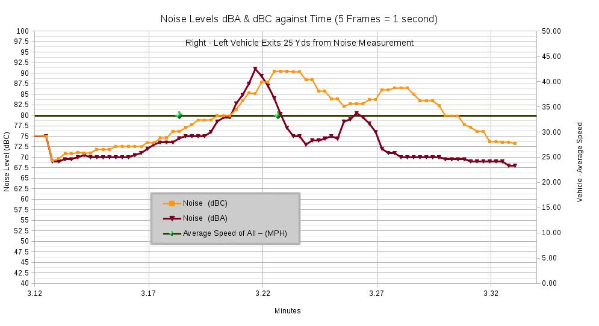
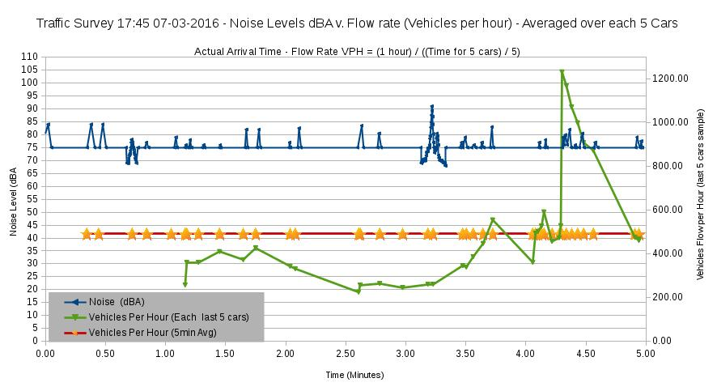
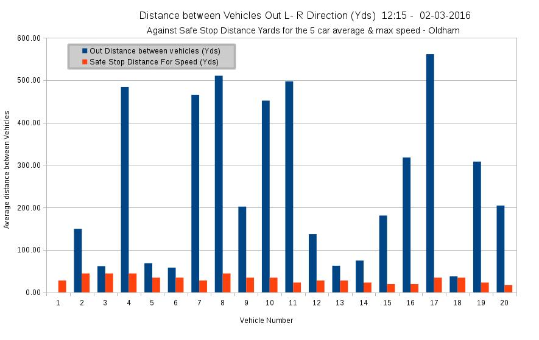

**Open Traffic Survey**

#Calibrating Road Traffic to Pollution : Part 1 : Noise#

**Introduction to a citizen Traffic Survey Methodology**

The aim of Open Traffic Survey is to outline a procedure which retains un-tamperable (video) evidence of Traffic characteristics and provide an open source spreadsheet into which data can be input and visualised with charts.  This survey is the result of a number of weeks work recording traffic and noise levels at the Oldham test site. These results were analysed in depth and a resulting updated Traffic Survey template spreadsheet was produced for 5 minute surveys. 

The choice of a 5 minute survey arrives from previous survey results showing better than 25% error when predicting vehicles per hour (VPH) from vehicles per 5 minutes of flow readings. It was already shown from the 2013 test site survey traffic surveys, that the site has reasonably consistent flow of traffic from  07:00 till 19:00. Other sites might have more "lumpy" traffic flows and require longer surveys. It is recommended to uses 2 * 5 minute surveys, it has been found that these are time consuming, but more manageable than a full 10 minute or longer survey. 

If you are using the Template to investigate a new Traffic flow test site, it is good practice to get a set of baseline readings at various times of the day. For instance, say 4 * 5 minute surveys would give a good indication of the variability. This would show how the new site differs from the template site, in order to understand which measurements need to be taken to describe the new site. i.e to capture the peak or lowest flow / congestion / speed times from observation. 

Whilst the spreadsheets help set up a comprehensive survey, each survey is different. It is important to double check all charts are correctly ranged and that all calculations refer to the correct fields 

**Data collection methodology**

Three traffic surveys were completed to gather data for an analysis of road traffic noise characteristics. The aim being to produce a template spreadsheet that can facilitate others to analyse the effects of traffic.

**Traffic against Noise : Survey 1**

**01 - Traffic Survey with detailed noise analysis using (fast averaging) dBC Sound Level Meter. Analysis of calibration noise per vehicle**

02-03-2016  12:15 Weekend :  

Continuous noise survey using dBC, noise of vehicles at 1m and 25m distance, Estimate time above noise level bands, calibrating noise against vehicle speed, investigate minimal noise levels at test, speed, flow, separation and time traffic analysis.  

**Traffic against Noise : Survey 2**  

**02 - Traffic Survey, test use of VMPH to noise calibration**

02-03-2016 18:00 Weekend :  

Testing Noise Calibration (per speed of vehicle), speed, flow, separation and time traffic analysis.  

**Traffic against Noise : Survey 3**  

**03 - Traffic Survey taken after 5 o'clock, calibration dBC to dBA, detailed noise band analysis of the length of time per vehicle above 75dBA**

07-03-2016 17:45 Weekday 

Noise levels recorded at > 1m, 0.5m height dBA (BS 5969) against/Calibrate dBC meter. Further tweaked all charts and added Time between vehicles, Both ways, In and Out traffic.  

**Summery :**  

The spreadsheet TrafficAnalysisSpreadsheet.Noise.5MinuteSurvey.Template.-17.40-07.03.2016-01.ods shows real data from the Oldham Test site and can also be used as an 5 minute traffic survey Template.  

TrafficDataCollectionMethodology.md  explains how the data was collected and the equipment used.  

TrafficDataAnalysisMethodology.md shows how the data was analysed in the spreadsheet.  

The README.md document records the main conclusions and observations and pertinent charts taken from the three traffic surveys.  

#Conclusions and Observations#

**What are the level and effects of Noise at the Traffic survey Test Site**

The level and effect of continuous traffic noise is obvious to any person adjacent to it.

Because it has been a difficult economic and technological move to reduce pollution from vehicles, the public does not understand that vehicles still generate noise levels that would require ear protection in a work environment.

Many shop workers, street cleaners, bin collectors and such really should be wearing ear defenders, if they don't want to go deaf early.

Many extremely dangerous sounds such as impacts and not even measured for in many cases. Similar research on the danger of impulsive noise from guns resulted in ear defender regulation. Yet, massive impulsive noise from dropped man hole covers, or banging chains on skip lorries are common dangerous noises exposed to the public.

The noise levels from vehicles are very significant. Any further increase in traffic would further degrade the time bellow dangerous level of noise, even with vehicle wheel noise being the major noise source.

The data collected over the years at the test site shows a very significant decrease on time where noise is at its base line level and a significant increase in time over dangerous levels.

When the test site occupant moved to the test site, it was recognised to be a restricted area, where development was difficult and intrusive. It was designated mixed rural, light industry and residential.
It seemed to be recognised by planners at the time that, such as,  a small number of lorries that didn't inconvenience the residence if a turning circle and other deteriorative aspects were recognised and accounted for.

However, it was then advantageous to "over develop residential", remove land from the farm making it un-viable and develop the low traffic industrial site as a school, possibly doubling the hourly traffic during school rush hour. i.e ignoring the special circumstances of a high, narrow valley with one access road.

The levels of noise due to traffic at the test site are very significant. It is likely that someone working in the garden would already be exposed to noise levels that cause physical and mental stress, contribute to hearing damage.

The level of noise above the very low ambient level further amplifies the disturbing effect of the "random" loud noise  above "incredibly" quiet background noise levels. The tight, steep sided valley also means noises are carried directly to the other side, where a canal and park / farm land. 

On a contrary note, it was noted that the trains cause a high level of noise to both sides of the valley and that low flying planes and helicopters also produce a disproportional level of disturbance due to the same effects.

For the disabled, the noise is at such a level to make the partially deaf or old have difficulty hearing other conversations.

It is recommended that a further dB LEq noise survey be conducted to exactly prove the current noise dose overall compared to work place regulation. Calibrate the Nose LEq level per vehicle.

Noting :

 There is only one main way into the test site road.
 It is not possible to widen the road because it is in a tight valley.

It is recommended,  In order to prevent overt damage and discomfort to those residence who live "adjacent to" and "pedestrians walking on", the test site road :

1. It is recommended that action be taken to decrease the levels of traffic.

2. Action be taken to alleviate the traffic noise danger of residual traffic at the test site e.g quieter tarmac, no pot holes fix all "dropped man hole covers".

3. Action be assessed for other areas with same problems i.e Valley with close buildings reflective to noise and one road through for traffic.

**What are the sources of Noise from Traffic?**

Preliminary analysis at the test site indicates the major component of traffic noise is due to wheel / road surface interaction. The traffic is mainly free flowing and is not generally decelerating or accelerating where the readings are taken.    

The secondary noise in this case appears to be from vehicle exhaust noise. This is indicated by the tendency for noise to be greater when measured behind the vehicles than in front, for both directions.  

In other circumstances, where vehicles are starting and stopping or struggling up hill then engine and exhaust noise would probably dominate.  

**Is there a relationship between Noise and Vehicle speed?**

It was possible to use the data collected in Survey 01 to test various relationships, it can be clearly seen there is a relationship between speed and noise.  That relationship also held despite the wide variety of speeds and types of traffic at the test site, such as slow moving noisy tractors and fast but quiet cars "rolling" past.  

**Calibrating dBC noise readings against dBA**

It was noted that the readings from dBC and dBA were not that dissimilar for traffic noise. For traffic noise a simple dBC meter can give a genuine indication liable effect.  The Survey 03 contains some detailed comparison of dBC to dBA levels.

The calibration factor for traffic noise was calculated in survey 3. The highest levels being recorded as each vehicle passed which compensated for the phase difference between the two meters. This phase difference may be due the DAWE dBA instrument being solid state was able to operate faster, whereas the dBC Sound Level Meter was digital. Or the phase may simply be due differing sampling periods on each instrument.

For traffic going both ways Average Calibration Factor dBC to dBA was calculated as 0.97 with Standard Deviation 0.03

For Traffic travelling In – Average Calibration Factor dBC to dBA  was 0.98 with Standard Deviation 0.03

For Traffic travelling Out – Average Calibration Factor dBC to dBA  was 0.97 with Standard Deviation 0.03

**Detailed comparison of dBA to dBC readings at the test site**

 

Various ways were tested to estimate the overall level of noise. In this case the dBC is averaged for each of the minutes of the survey. This can be calibrated later against the noise LEq meter, so that vehicles can be calibrated directly against health damage.

**Test site traffic noise levels (dBC) overall and averaged per minute**

 

The base noise level at the test site is extremely low, less than 40 dBA. It is well known that noise is more intrusive when compared against low background levels.  

The highest levels of noise observed were for noisy vehicles, such as tractors and buses. Peak Noise levels for these vehicles often exceeded 85 dBA.  

Noise levels when buses passed each other (a not too unlikely event) noise levels exceeded 90 dBA.  

Noise levels remained high for significant periods of time / distance as vehicles passed. A number of estimation methods were tested which showed levels of noise 30 to 40 dB over background for significant periods of the day. The test also showed peak levels above 75 dBA for significant portions of the sample times.  

**Traffic noise levels in dBA shown against traffic flow both ways**

 

This chart from Survey 01 on the 2nd March 2016 at 12:15 shows the level of Noise in dBC against traffic flow. It can be clearly seen the effect of traffic on noise and how that becomes noise continuously high as flow rates increase.  

**Traffic noise levels in dBC shown against traffic flow both ways**

This chart from Survey 01 on the 2nd March 2016 at 12:15 shows the levels of noise from the full survey. 

The noise levels of each of the noise bands were allocated for the 410 readings of dBC taken during the 5 minute sample time. If the dBC was above a value that reading was allocated with number 1, zero if bellow. The percentage in each range was then totalled as a percentage of all the readings.  

As can be seen during the detailed test on Saturday 02-03-2016 at 12:15 with a relatively low VPH of 360, the noise levels were above 80 dBC for 50% of the time. Calibration of the dBC meter for traffic noise against dBA shows that would indicate noise levels of 75 dB for 50% of the time.  

The minimum sound level recorded on 02-03-2016 shows another disturbing aspect of the noise. It is well known that impulsive or changing noises are found more disturbing, and that noises above a low threshold are also more disturbing. In the test case the noise level varied from it's low of 43.7 dBC through to a peak of 93.1 dBC through an average of 74 dBC.  

**Percentage Time Traffic noise exceeded noise level bands (dBC)**

This chart shows from  12:15 02-03-2016 shows the noise levels measured as vehicles entered and exited the measurement box. This shows that the effect of the noise of the vehicle is extended over the 25 yards of measurement. It can be seen that the noise increases as vehicles approach and can increase further from exhaust noise, when individual vehicles passing were studied.  

Traffic |   In	|    Out |  
-------------- |    ----    |   ----    |  
Base dBC    |	35	| 35   |  
Calibration   |	1.4	| 1.48  |  

In the Survey 1 the equation  noise level = speed * Multiplication factor + base noise level. Various values were calculated and plotted on the calibration chart, the value chosen for the lowest error. Where the error is the "natural" variability in noise from each vehicle, not the equipment.

**Calibrating speed against noise**

**Noise level against speed  of In and Out direction traffic showed separately**

The analysis of vehicle separation against safe stopping distance for the 12:15 02-03-2016 survey showed the most dangerous times for vehicles were when they were being slowed in congestion.  That is the time when vehicles are travelling at or above the safe stopping distance for their speed. 

The danger of congestion had been noted in previous surveys but flow rates were only being estimated from an average of each way traffic, so the new surveys included a methodology to split the in and out traffic by sorting and coping the frames and other data into a new section of the spreadsheet for In and Out traffic. A lot of work was also done to update all the charts with relevant In Out data where applicable. 

**Separation of Outward Vehicles against stopping distance for each vehicles speed**

Time between vehicles has been added to the new template spreadsheet.

In the Noise test case, it had already established that large vehicles need special measures, like turning circles, to be able to operate. It is established in planning that new developments reduce danger entering the road by improving line of site. 

Yet at the same time the planning process has allowed accelerated development of the area and left some residents to feel the brunt of the over use of limited infrastructure, such as the narrow road with no pavement or off road parking at the test case.

Clearly the Planning process needs a review as it is not acting in the best interest of all parties when allocating infrastructure access. In particular, the test case shows the planning process is either unaware of the danger of increasing traffic to current residence or ignoring that for the benefit of developers.

The new charts of exact time between vehicles is now possible with the new spreadsheet. This one is from 12:15 02-03-2016. The time between vehicles was further reduced when the evening of 07-03-2016 was surveyed the average time between vehicles dropped to a 7 second average. It was also noted further information was available on wait times to exit, for instance there were extended periods in all surveys where time between vehicles is less than 7 seconds....

**Time between Outward Vehicles against average time between each vehicles**

**Further work :**

Leq meter (cumulative noise) and other noise calibrator required. Frequency analysis system,
CO2, CO, NO2, SO2, wind speed per vehicle

**Licensing**  
  
{**OpenTrafficSurvey**}
    Copyright (C) {2015 / 2016}  {Wrapperband}

    This program is free software; you can redistribute it and/or modify
    it under the terms of the GNU General Public License as published by
    the Free Software Foundation; either version 2 of the License, or
    (at your option) any later version.

    This program is distributed in the hope that it will be useful,
    but WITHOUT ANY WARRANTY; without even the implied warranty of
    MERCHANTABILITY or FITNESS FOR A PARTICULAR PURPOSE.  See the
    GNU General Public License for more details.

    You should have received a copy of the GNU General Public License along
    with this program; if not, write to the Free Software Foundation, Inc.,
    51 Franklin Street, Fifth Floor, Boston, MA 02110-1301 USA.

