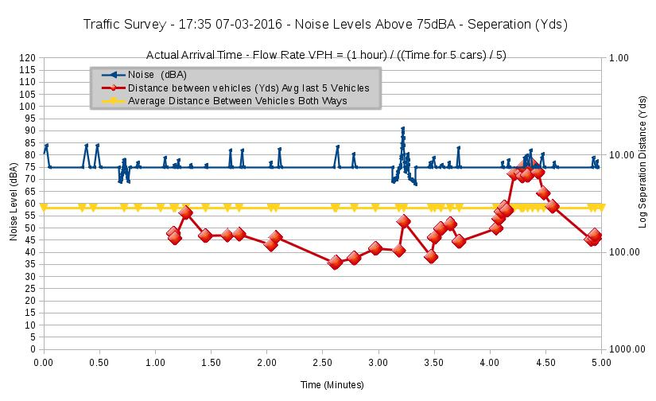
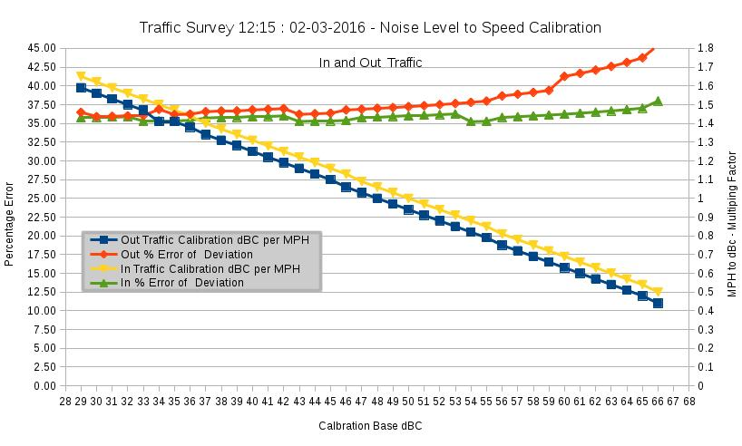

#Open Traffic Survey
**Methodology for analysing the Traffic data with the citizen traffic survey spreadsheet**

#Calibrating road Traffic to Pollution : Part 1  Noise  

#Data Analysis   

The data analysis methodology describes the fields in the template spreadsheet using real data from a number of Traffic audits to explain what they mean and how they are calculated. The template spreadsheet contains real data from the test site.

The analysis and observations reported at the time have been included, along with some updates to the spreadsheet, to provide more documented charts and guides to show how it can be used and errors and limitations. 

The aim is to make a difficult task of analysing data easier for anyone to do, and provide more detail automatically, if possible. Where it is not there are tips and explanations of such as what problems occurred and how situations might differ and how that could be dealt with.

This document contains explanation of the Test site Traffic surveys analysis. The third survey covered calibrating dBC to dBA levels and has been added as a 5 minute survey Template sheet. The 5 minute survey has been proved to show reasonable accuracy when predicting VPH figures.

TrafficAnalysisSpreadsheet.Noise.5MinuteSurvey.Template.-17.40-07.03.2016-01.ods

**Fields of the spreadsheet**

**Information fields for the Spreadsheet.**

Rows 2, 3, 4, 5 and 6 of the spreadsheet store the identification data for the survey and total and average information collated from the subsequent analysis columns.  

**Cells on the Template sheet - Data Input and Calculations**

Cell H3  - **Address of Traffic Survey location**  

Input the Address and postcode of the position the video of traffic was taken

Cell H4 - **Distance  25 Yards**

Measured distance travelled by the vehicles entering and leaving the analysis box.

The spreadsheet has been updated to be interactive, the Vehicle speed and error is calculated using the Distance in Yards in Cell $H$4, which has been marked sky blue in the template.

Cell H5 - **2016-02-27-20.00-21.avi**

Name of the Traffic Flow Evidence video that is being analysed

**Example collated average and totals / information for the full period of the Traffic Analysis**

Description of Calculation | Example Value
-------------------------- | -------------
Vehicles Per Hour   |	492.00   
Average Speed (MPH)   |	33.20  
MaxSpeed (MPH)   |	51.14  
MinSpeed (MPH)   |	23.24  
Traffic Flow VPH Max   |	1500.00  
Traffic Flow VPH Min   |	225.00  
MaxDistanceBetweenVehicles (Yds)  |	129.09  
MinDistanceBetweenVehicles (Yds)  |	12.76  
Traffic Flow VPH Avg   |	614.13  
AvgStoppingDistance (Yds)  |	30.32  
MaxStoppingDistance (Yds)  |	60.63  
MinStoppingDistance (Yds)  |	16.75  
AvgDistanceBetweenVehicles (Yds)   |	58.12  
AvgTimeBetweenVehicles (Secs)   |	7.23
  

That data is then repeated for traffic flowing in and out at rows 66 and 94. It is the same information from the overall analysis, but the 0 and 1 direction marker field  and the frame field can be used to sort the rows into just the left or right components. Then cleaning up the calculations. Splitting the data makes much more accurate time and separation calculations for the vehicles over the each way estimates.

Rows 166 onwards of the spreadsheet have been used to input the detailed information for dBA against dBC. Two vehicles were chosen going wither way and data recorded every time the noise varied, typically every couple of seconds. 

Column  W X Y Z AA AB were used to show how you can calculate the increase in traffic over subsequent years. The actual increase in traffic is usually larger than the TEMPRo estimate, which is calculated from data spread over all location traffic flow types.

#Charts available in the spreadsheet#

**Speed**

The "speed" tab of the spreadsheet shows the each way speeds and speed split into left and right traffic. R - L traffic is Out and L - R traffic is in. Out going traffic is > 4m from the noise measurement. Incoming traffic is > 1m from the noise measurement.

The noise measurements include the error if the readings are +/- 1 frame out. This is a wide error for the accuracy of the equipment and human observation of a stop motion video. The levels of speed seen also confirm the accuracy of the system, for instance when test against a car at known speed it gave accurate results. 

The average speed level is also shown.

**Flow**

The first chart shows the Flow rate for the sample period and the flow rate calculated for the last 5 cars. 

The next chart in the spreadsheet shows the same flow data but in time. I can be seen why the flow rate increases when vehicles start to become congested.
The same data is then shown for the left and right moving traffic in the next two charts.

The final flow chart shows using the simulation field to see what 2 x Traffic would be.

**Vehicle Separation & Danger**  

The spreadsheet calculates the separation of vehicles as an estimate, combining both ways traffic. The calculations for  traffic in each direction is more accurate as the distances can be more exactly calculated from the speeds of the vehicles.

**Noise Levels**

These charts show the noise against speed, flow and separation. The first chart, Noise against speed, shows how similar the dBC and dBA readings were once phase had been taken into account.

The second chart for flow rates shows how the traffic noise is kept high, as traffic bunches The vehicles are shown at time of arrival.

The next 2 charts show a detailed calibration curve for two traffic events, in detail. Each shows the effect of traffic in different directions, the second also showing two events. The phase difference between the videos (noise and flow), was made adjustable on the spreadsheet and aligned. The phase difference between the two instruments can then be seen.

The dBA meter has a quicker response and appears to be averaged over a slightly shorter time period. Otherwise the instruments were surprisingly similar in calibration. 

It is concluded that, for the frequencies involved in the traffic noise at the test site and the limitations on the dBC meter and microphone, the multiplication factor to convert a "peak" dBC to dBA of 0.97 +/- 0.03 would give a reasonably accurate estimate of the dBA noise level.

The next chart is shown bellow. It shows detailed analysis of the dBA noise level figures above 75 dBA. One of the disadvantages of the DAWE instrument is it has no auto Band switching, so had to be set at 80dB, which gives readings between 70 and 90 dBA. Some sample tests were also done to confirm sound levels were compatible at lower and higher ranges, the Maplin instrument was calibrated to the DAWE 70 - 90 dB range. As the majority of the noise range produced by traffic is in this range, this seems sensible.

**Traffic noise levels in dBA shown against traffic flow both ways**

 

The next few charts are quite complex as they show In and out traffic data against noise and average levels. However they detailed aspects of noise production.

The first shows Noise (over 75 dBA) against vehicle speed, the next two show Separation of vehicles against noise, both ways then each way. The separation is relatively correct, showing the variation. The next chart whilst more complicated, shows the more accurate readings available for separated IN and Out traffic. The separation scale on the chart is logerithmic to show the current wide dynamic range of flow, free to congested.

**Traffic noise levels dBA against separation of both ways traffic**

 

The next two charts are unused in this survey, they attach to the manual analysis fields for a dBC (or other auto ranging) survey. The current dBA meter, whilst accurate for calibration is limited by manual ranging, otherwise these charts would have been included.

**Predicted Normal Increase in Traffic Charts**

This sheet has charts showing the various methods of calculating the likely increase in traffic. It is not known the exact TEMPRo version used on the test site, so the standard ones are shown.

**Increase in traffic per day for next 15 years as predicted by TEMPRo** 

**Noise Calibration Per MPH**

Shows the charts of the Noise to speed calibration taken from the dBC readings in survey 1.

**Calibrating speed against noise**

**Calibrating dBA Traffic Noise from dBC noise readings x 0.975 at Test site at low (day) flow rates**

 

