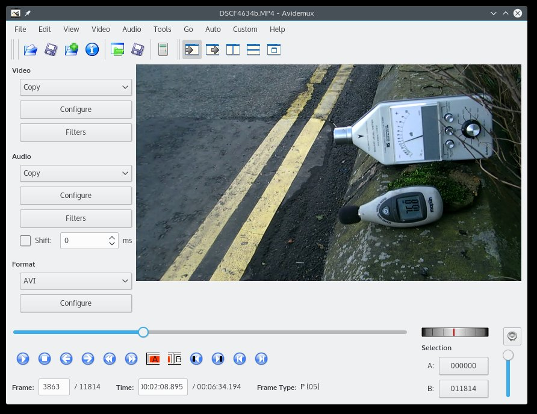

#Open Traffic Survey
**Data collection Methodology for automating a citizen traffic survey : Test site example survey**

**Calibrating road Traffic to Pollution : Part 1  Noise : Data Collection** 

**Equipment :**

DAWE 1405D - dBA meter BS 5962 Type 2  
DAWE BS Pistonphone noise calibrator  
Maplin Sound Level Meter N33GJ dBC meter  
  CE    Measurement Range : 40 - 130 dBC +/- 3.5 dBC @ 1KHz 94dB  
  Frequency Range  31.5 - 8 KHz  
Logitech USB cameras C920  
Fuji finepix S2000HD Camera   
Powered USB Hub  
Kubuntu  
Avidemux-qt  
Guvcview  
Libre Office Spreadsheet  
1 yard stick   
chalk or charcoal temporary marker  

**Open Traffic Survey - Methodology : Collecting the data**  

**Hardware Set-up**

*Where to place the camera*  

Position the camera at a suitable place to video record the traffic, preferably side on.  

Care needs to be taken with USB cameras, the length of cable is restricted in most cameras. One way to get over this problem is to use a cheep camera with a Laptop.  This means the camera can be placed higher up, to look down on the traffic.  

The other way over this problem is to use the Logitech C920, which compresses the video to MPEG on-board in the camera, so can transmit HD over a slightly longer USB cable. In this case the powered USB was used to ensure enough power to the Camera.
  
In this case a suitable angle was available so an extra wide angle lens wasn't need. It was possible to measure 25 yards along the pavement. The camera was position at an angle so Out traffic travelling Left to Right, enter the box adjacent to the camera and leave 25 yards later. 

The reverse happens with incoming traffic, right to left, it enters 25 yards away and exits close to the camera.

**Record video of the traffic.**  

In this case the traffic samples were 5 minutes, taken in 3 surveys scheduled at different time of the day. Most surveys so far have been during the mid work day, so the three new surveys are mid and evening Weekend and Weekday rush hour.

Recorded to a PC with Kubuntu and used open source Guvcview software to save the video. 800 x 448 resolution gave the best wide screen accuracy of vehicle position but small file size. However, 640 x 480 would also have surfaced if storage space is tight.

A number of extra 5 min samples were taken around the time, in case further historical analysis is needed.

In addition to recording the traffic at 5 frames per second, in this case additional information was recorded at the same time. A second video camera recorded pollution levels, in this case Noise at 30 fps. These were then synchronized to start at the same point as the Traffic analysis video. 

In survey 01 the extra Noise data was recorded In and Out of the measurement box and a more detailed chart was produced with readings every couple of seconds to show the variation over time. In survey 03 the comparable noise levels were recorded with the traffic at the position closest to the camera for calibration purposes. 

The sound level meters were placed at a hight of 0.5 meters, adjacent to the level of vehicles or the the level one might sit in the garden, in this test case

 

**Measuring the distance travelled**  

Using the yardstick the distance on the pavement of the street being monitored was measure and 25 Yards from one side of the video image to the other, on the street.  In this case obvious markers such as the telephone box were used to mark the 25 yards, but chalk marks were used to help measure correctly.

Vehicles were recorded as they entered and left the box. As normal the start and end frames numbers were recorded, but also noise level measurements.

01 - Traffic Survey with detailed noise analysis using (fast averaging) dBC meter  
02 - Traffic Survey, test use of VMPH to noise calibration  
03 - Traffic Survey calibration dBC to dBA  

In the case of survey 01, dBC noise was recorded in and out. In survey 03 the noise was only recorded as vehicles were close to the camera, but value of dBC and dBA were taken.

The video can now be analysed using a video editor such as Avidemux.  

As each vehicle enters the frame, the spreadsheet is updated with the frame number from the video.  As each vehicle leaves the (25yard) frame, the spreadsheet is updated with the frame number from the video and a direction indicator field is set to 0 for left right traffic and 1 for right left.   

**Ensuring correct frame rate index**

Sometimes using cheep cameras or open software to record long periods of video the AVI files can go wrong, files can loose their index. 

However, it is possible to re-index the files using ffmpeg.

Commands for using ffmpeg (Linux terminal)  to repair AVI video files index.

ffmpeg -i 2016-09-24-4.avi -c copy 2016-09-24-4-re-indexed.avi   

