## Open Traffic Survey  
**Introduction to a citizen Traffic Survey Methodology**

The aim of Open Traffic Survey is to outline a procedure which retains un-tamperable (video) evidence of Traffic characteristics and provide an open source spreadsheet into which data can be input and visualised with charts.  

The Template spreadsheet contains data from a real world test case and the documentation compares various data collection measurements, calculates errors and variability and  observations from the test data collected.  

The system has been developed and tested at test site, all data, analysis and estimates from real data at the test site. The document is published publicly for use by all parties.

The previous open traffic survey spreadsheets have been updated to include the latest data at the test site compared to noise levels. It gas the development work in the open traffic survey at this point and to demonstrates how the template was modified to a test case. 

[Oldham Test Case recent results 2019](CalibratingTrafficAgainstPollutionP1.Noise/README.md "Latest Survey results for Test Case")

[Oldham Test Case Noise Calibration, conclusions and results 2016](https://github.com/wrapperband/OpenTrafficSurvey/tree/master/CaseStudies "Latest Survey results for Test Case")

**Open Traffic Survey : History of development**

The Open Traffic Survey is the result of "6 years work" (not contiguous) monitoring and analysing the traffic on a minor road in Oldham.  

The methodology arises from long term notes / study of how A.I. or Machine Learning techniques could assist in continuous environmental surveys such as traffic levels. i.e. it is an open source project to enable Environmental monitoring, contributions welcome.  

**Gathering Objective data**

The necessity to start manual analysis and record keeping arose out of the requirement of a local planning action group to have some source of "provable in court" information on the environment and how it was changing. That investigation resulted in various charts and calculations to show / visualise the true effect of "average vehicle flows" being experienced by the community.  

**Analysing and Visualising what the traffic data means and how accurate it is**

It was also envisaged that the system could be used to confirm or refute the error levels of "official data" collected at the time. In the test case where Traffic readings were taken at a non standard road position which would emphasis the low speed under counting, a known source of inherent error when using the low cost "Traffic Speed Surveys" systems for calculating "Traffic Flow Rates".

This chart is from the first spreadsheet with data taken from Video evidence, then manually counting the number of vehicles into  each hour "pot". A time consuming, but satisfying task as it dispelled pre-conceived ideas of what the traffic flows were. Evidence of high traffic levels on weekends and holidays dispelled the myth that heavier traffic in the week could be allowed as there is respite at the weekend, for instance ..... 

**Traffic Flow rates for 29th to 30th 10.2013**

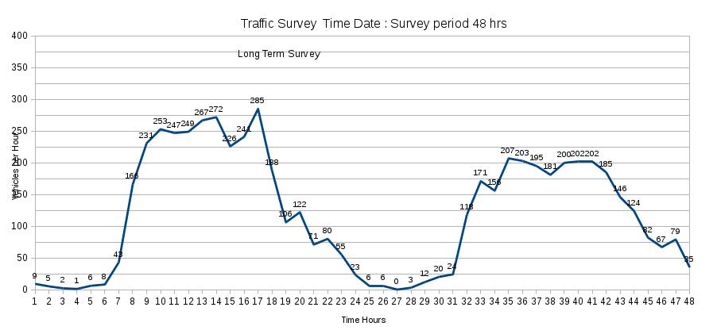  

**Open Traffic Survey : Observations and Results from Test Surveys**

**Is there any ways of easing the manual work in analysing and collecting the traffic data?**

Various techniques and common equipment were tested for potential use as sensors and analysis to speed up the time consuming parts of the process of auditing traffic levels. It is possible to set some software to trigger an image when there is movement in part of the frame. By adjusting the sensitivity it is possible to trigger an event when a car or bigger passes, but not a person.  

**Testing and calibrating the image trigger system**

In the 2010 Traffic survey, a triggering mechanism was used to save a single or small number of stills as each vehicle passing, which could be simply counted as the number of files in a folder for that time period. 

This proved effective for long term monitoring, it was used to prove there was no early morning or  early evening peak in traffic in our case. 

When the original results of the 2013 "Trigger Data" Traffic survey were compared with some manual readings, at the test site, the flow had to be calibrated with at least a multiplying factor of 2.  

It was therefore decided to complete a second 2013 study, using 2 hours of manual counts of traffic  into from 5 minute sample pots. 

Quite a lot of analysis was done of the manual data, to show deviation and normal variation of flow and accuracy of predicting hourly readings from different sample lengths.

The 2010 survey was also performed by a slightly different trigger method, where short videos were triggered and each was analysed manually. Whereas with the 2013 survey there were no false positives, the 2010 survey did have some. As this was a preliminary study different methods were assess for accuracy and the most likely settings were tested. 
A manual inspection of the videos were recorded into a spreadsheet and split in to categories and direction.

The video sample method takes up more time and resources than the 3 image 2013 method so is certain to require calibration by at least 1.5x.

**Recalibrated 2010 Traffic Survey Data 1.5x Trigger**

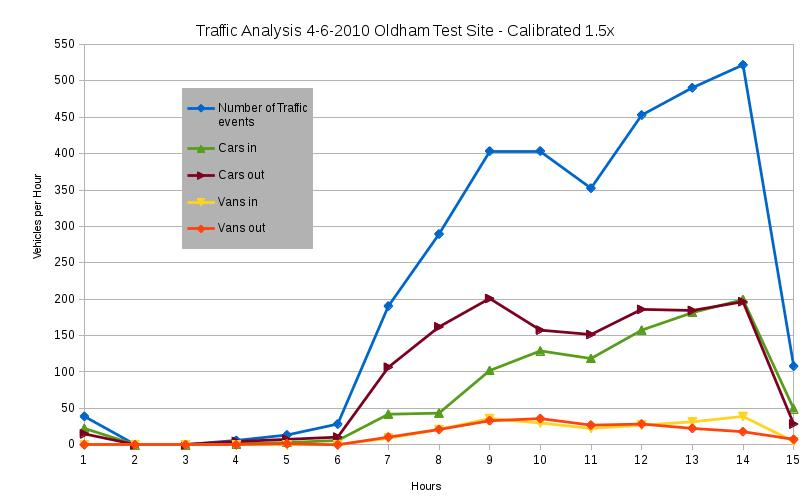  

The drawback with any triggering method it had to be subject a significant calibration. Although the calibrated values obtained were consistent and showed the "variation of levels" clearly, it under estimated the traffic by 1/3. (For the test site with a traffic flow of one car every 12 seconds) The calibration may be lower for lower flows, but meant the values need to be multiplied by 3 to get close to the actual figure. 

However, the video trigger method was surprisingly accurate for a method which required such a large calibration factor when sample tested with a manual count of traffic from a video.

**Why the trigger system underestimates the Traffic flow ...** 

Examination of the video evidence, compared to the triggered photo method showed the reasons why the trigger missed some vehicles :  

1. At the traffic levels on the road, traffic was often bunched <  less than the re-trigger time for the system.
2. Vehicles often passed in opposite directions at that point in the road (between parked cars on one side) only triggering one event.
3. Dull weather may have reduced the triggered count on some days

The other problem with devising a triggered count, is further research is required to find open source "image trigger systems" and produce a guide to how they can be used do automated triggered traffic flow levels.  

**Estimating the level of pollution from the Traffic Flows recorded**

"How Polluted is my road?" is a web site that shows official statistics and analysis of pollution in London obtained by "Clean Air in London" from Transport for London.

http://www.howpollutedismyroad.org.uk/ : shows some research information to help calibrate pollution levels from Traffic flow rate data :  

    "Are there more than 10,000 vehicles a day?"  

    "Scientific research suggests that living near roads travelled by more than 10,000 vehicles per day  
     could be responsible for some 15-30% of all new cases of asthma in children, and a similar proportion    
     of COPD (chronic obstructive pulmonary disease) and CHD (coronary heart disease)  
     cases in adults 65 years of age and older."  
  

**Traffic flows and pollution at the test site**
  
For the Traffic survey test site there were 310 vehicles per hour for 12 hours, that is over 3,700 vehicles a day. It is therefore clear adjacency of the road and the steep sided valley means the residence are already being exposed to dangerous levels of pollution, without further increases in development / Traffic . The proposed development threatening to increase the levels above 5200 per day.  

In the weekday traffic survey of the test site showed flow levels of 490 Vehicles per hour, or 5870 Vehicles per day, which would mean mean traffic levels of 7300 Vehicles a day, when the conservative estimate of extra traffic from proposed developments developments are included. 

At the test site a one way system is proposed to handle extra traffic from developments, this  would spread out the high noise levels, so they are virtually contiguous and increase noise from stationary and accelerating vehicles.

Currently moving traffic at the test site is "free wheeling" or low acceleration and taking  a short time to pass. A proposed one way system with traffic lights, will increase stationary traffic and will therefore increase the level of exhaust pollutants at the test site.

**Assessing Pollution from traffic levels**

The current research shows average traffic flow readings vastly underestimate the peak levels. The simulated traffic for the period the development would use, showed peak levels of 10,000 Vehicles per hour for one congestion event in the 10 minute sample and for over 3000 vehicles per hour for 3 events over 30 seconds long.

That analysis showed a flow of greater than "3000 Vehicles per hour" (not day) for (15 + 30 + 30 + 30) seconds, or 17.5% of the 10 minute Traffic Survey collection period at the test site.  
  

**What are the issues with air / noise pollution and transport trends?**

The dysfunctionally of the planning system, particularly with local roads is disturbing, what can we do about it?
 
The first thing to do is monitor the situation so those with responsibility can't continue to put their head in the sand, pretending what they don't know doesn't heart them...

Currently, the effects of traffic on the population near the roads is not even considered as a factor unless over kill danger is apparent, whilst new developments have every consideration of noise and traffic effect.

Traffic speed surveys, which are know to underestimate slow traffic, are routinely accepted as providing accurate Traffic Flow measurements by planners.

http://www.engineering.ucl.ac.uk/engineering-exchange/files/2015/10/EngEx-LSx-Community-Forum1.pdf

The engineering Exchange conference in 2015 shows the poor state of controlling pollution through traffic flow.

Basically, this proves that planners must be to blame for the deteriorating effects, they have allowed developments to continue far beyond any sensible strain on the infrastructure, health, welfare of residence. 

A poor planning decision only has to go through once and then it is established for ever, there seems little comeback for "planning mistakes" such as over building or ignoring distances, often they are just accepted in a future meeting.

These endemic faults indicate action is required to correct those failures.   

    The knowledge that a small sample can give extensive information 
        about the effects of traffic is one step to monitor the situation.  
    Current CCTV could be upgraded to include traffic flow estimates.  
    Traffic flows could be calibrated to pollution levels.   

**What is considered a traffic problem in the UK?**

Nothing is considered a traffic problem in the UK, planning will try to mitigate or make the best of any increase in traffic. However, planners must now fall in line with National Policy or NPPF.

https://www.gov.uk/government/uploads/system/uploads/attachment_data/file/6077/2116950.pdf

"In line with the National Planning Policy Framework, highway authorities are now asked to consider whether new developments have a ‘severe’ impact on the network, taking account of mitigation measures, before considering recommending refusal to the Local Planning Authority. 

To date, there has been no published guidance as to the definition of what is ‘severe’."

(From : http://www.lincolnshire.gov.uk/transport-and-roads/strategy-policy-and-licences/control-of-new-development-affecting-the-highway/growth-and-planning-for-highways/128325.article)

**Considerations of severity**

The Lincolnshire County Council say :

*Whilst there is no definition of severe within the National Planning Policy Framework, it states that “all developments that generate significant amounts of movement should be supported by a Transport Assessment… plans and decisions should take account of whether: the opportunities for sustainable transport modes have been taken up, depending on the nature and location of the site, to reduce the need for major transport infrastructure and that safe and suitable access to the site can be achieved for all people. And improvements can be undertaken within the transport network that cost-effectively limits the significant impacts of the development. Development should only be prevented or refused on transport grounds where the residual cumulative impact of developments is severe”*

**Currently we base severity on Inspector’s decisions in the past which have been published and we consider the following to be significant considerations:**

  Safe and suitable access is a requirement for all proposals.  
  If a proposed development is not safe and suitable, then irrespective of volumes of traffic or queuing, the development can be considered unacceptable.  
  This means that small developments which generate little traffic can still be unacceptable in highway terms if not safe or not suitable, e.g. poor visibility at access.  
  If traffic queues are likely to cause unsafe scenarios e.g. blocking access to a hospital or creating ‘rat-runs’ which are dangerous.  
  If Inspectors’ have deemed the traffic impact on the network to be severe.  
  If the junction is a key one on the network or a less critical junction.  
  The period when the junction exceeds capacity and the length of queues.  
  Junctions may only have lengthy queues for 15 minutes in the peak hour and this can then be considered acceptable since the development will be accommodated, but it will be considered if the peak time will increase in the future.  
  If existing congestion is already severe.  

**There is no improvement in  a system unless it has some feedback on how it is performing.**

For the planning system, one idea would be to publish statistics from detailed follow up checks on "allowed plans" by the system. As has been shown with manufacture quality control and the study of the accuracy of traffic flow from samples, a small sample of 1 in 10 planning applications studied in detail of what was delivered against the plan.

Longer term condition monitoring of the planning system should concentrate on it's effects, such as quality and availability of parks and play areas, the levels of noise, or amounts of accidents, or such. To be meaningful they need to be broken down into close geographic locations.  

**Standards for Road Layouts and pavements**

The HSE release the Technical Measures Document deals with design codes relating to roadways, site traffic control and immobilisation of vehicles.

http://www.hse.gov.uk/comah/sragtech/techmeastraffic.htm

Road layout & geometry

The following are important considerations in the design of road layout:

    Consideration should be given to physical characteristics of the road such as the horizontal 
       and vertical alignment, camber, width, headroom, visibility, drainage, and junction design etc;
    Road layouts should be designed to normal highway engineering standards;
    There should be appropriate segregation between pedestrians and road traffic;
    Parking and loading/unloading areas on site should be separated; and
    Signing and road marking should be in accordance with public road network standards
    Hazards, restrictions and directions should be clearly identified and communicated by signs, 
         signals and instructions.

Where it is more difficult to apply then :

"In larger sites, individual access roads should feed to the main distributor road, which should not provide direct access to individual factory units. All two-way industrial roads should have a minimum width of 7.3 metres. Curves should be of sufficiently large radius to permit HGVs to pass without the need for local widening. Only where this is not reasonably practicable should local widening be provided to cater for the swept path of HGV vehicles. Individual premises should have an access of minimum width of 6.1 metres. Standard clearance should be provided under all overhead obstructions. Consideration may have to be given to the provision of specific abnormal vehicle routes."

**Compliance with pavement standards.**

As part of such a large development the traffic design should have complied with standards, for instance "pavements" .....

http://www.standardsforhighways.co.uk/dmrb/vol7/section2/hd3901.pdf

For the new designation of the "new road system", all the pavements should have been considered in the standards for a Heavy vehicle Category road. That should also include where there are no current pavements, i.e. test casew.
   
**Open Source Systems : Philosophy**

The "Open Traffic Survey" is conceived as part of Open Condition Monitoring Tools, which is also conceived as open source tools to enable to enable the public to run easily audit-able "Open Governance Systems" or "Government monitoring systems".

  1. Open Governance  
    1. https://github.com/MrChrisJ/World-Citizenship  
    2. https://github.com/wrapperband/Open-Condition-Monitoring  
      1.  Traffic flow estimator   

Open Governance is used to describe tools that might be used to provide facilities, normally provided by Governments, to those in the World without that infrastructure.  

It can also be seen as technology to remove as many areas from "human trust" to "trust systems" that are outside the bounds of normal human manipulation. For instance, Bitcoin Blockchain attempts to take the release of new capital / money out of "human hands" and release it at a standard level without "inflation". In the Bitcoin trustless system money can not be simply "printed" for short term political purpose.

It well known that humans do not have full conscious control of all of their actions, it is unfair to tempt the unconscious, which is working at lower animal level and doesn't understand the ethics when tempted.  The human sub conscious can see a minor error could end in their favour might make it without the conscious even knowing. This is why entrapment of any type should be illegal in any civilised society, anyone can be entrapped.

http://phys.org/news/2016-02-women-susceptible-contagious-men.html

Study shows winning causes people to be more likely to cheat the next time
http://phys.org/news/2016-02-people.html

Feeling sleepy? You might be at risk of falsely confessing to a crime you did not commit
http://phys.org/news/2016-02-sleepy-falsely-crime-commit.html

**Monitoring "Trusted Systems"**

"Trustless systems" can therefore be used to audit "Trusted systems". 

In order to achieve that trust with "trusted systems"  it will be important that the general citizen can reproduce the work of the "Public Servant", in order that the effect  of work can be monitored. Currently the political systems in most countries have evolved to better serve those at the top, mainly by obscuring any cause and effect or over complicating regulation as there is no feedback or normal quality control or improvement.

      
**Example Traffic flow charts from the Traffic data analysis spreadsheets**

**Traffic Flow Rates May 2015**  

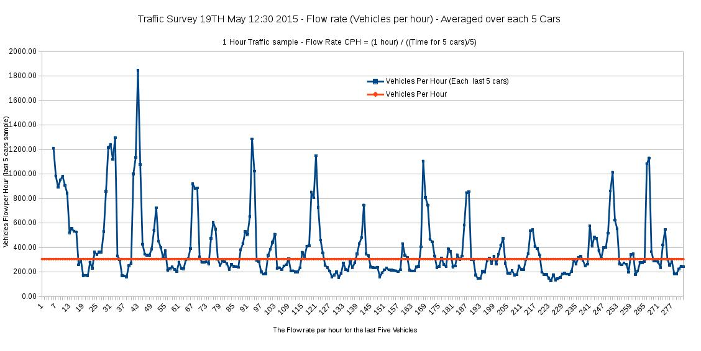  

**Traffic Flow Rates January 2016**  

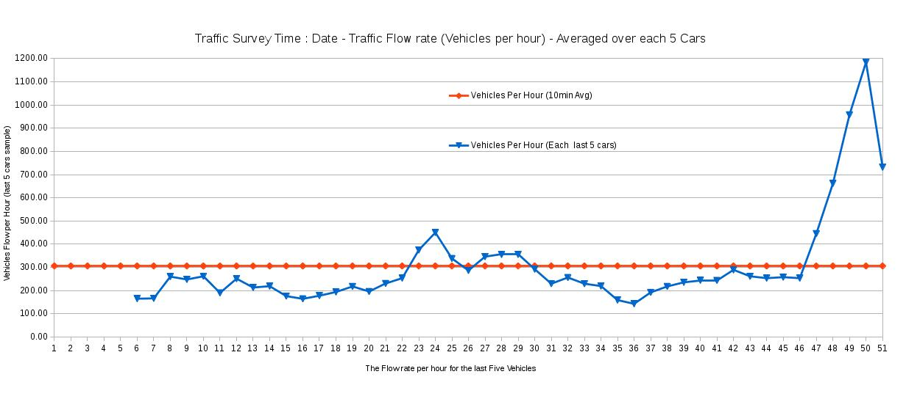  

**Traffic Survey of vehicles types 2010**

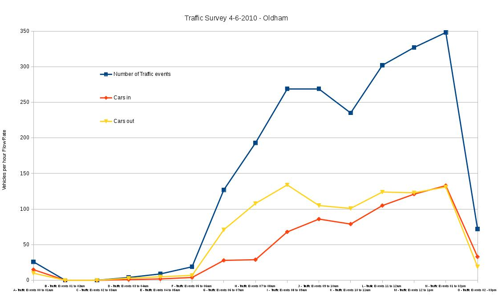

**Traffic Survey of vehicles types 2010**

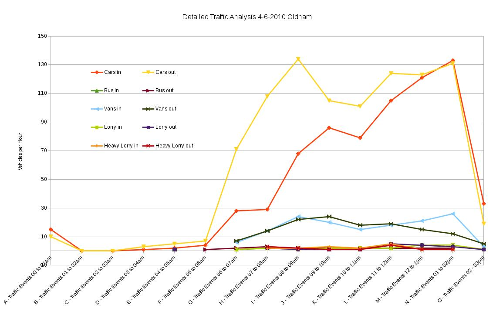

**Distance Between Vehicles - 2016**

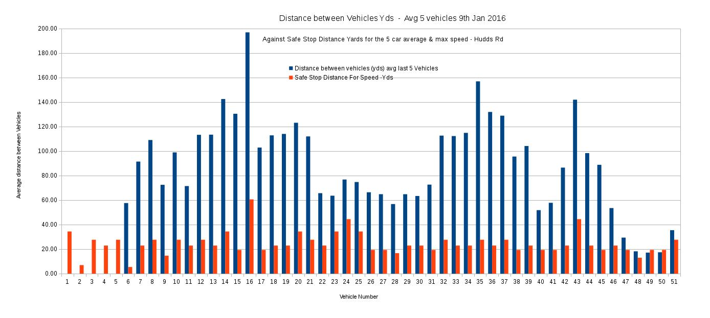

**Speed of Vehicles - 2016**

**Chart of 2016 sample data plus Simulated extra traffic levels predicted from development plans 8:15am till 9:00am**

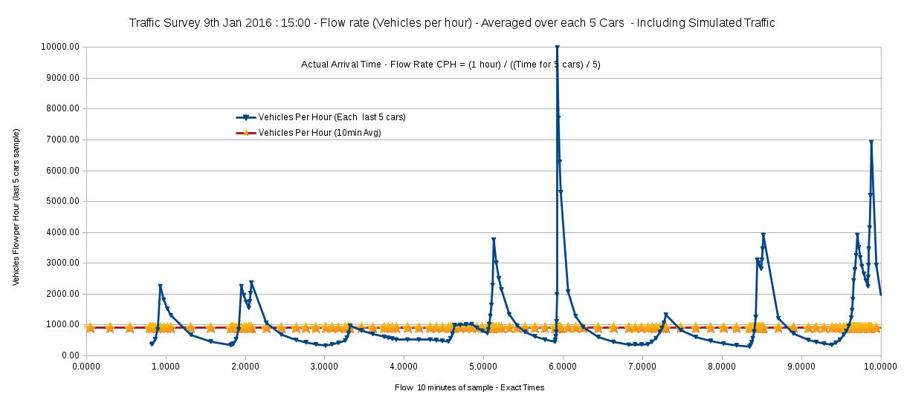

**Manual Calibration chart Nov 2013 for the 5 minute sample data - shows "under-estimation" of flow using the trigger systems**

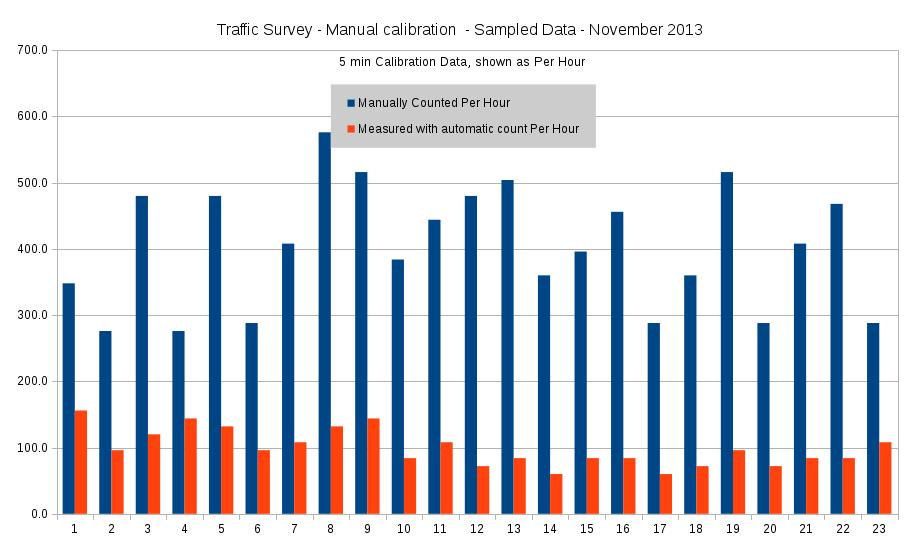

**Traffic flow for "Bank Holiday" October 2013 at sample site, showing Triggered and Calibrated flow levels set at 2x**

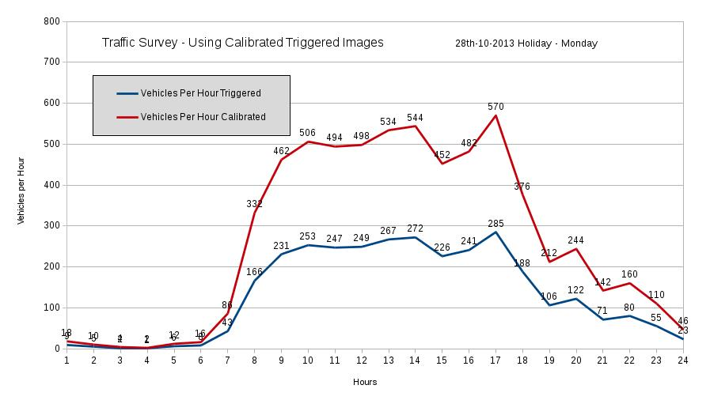

**Long term Traffic flows for "Holiday week" October 2013 at sample site, achieved using Triggered Image system, 2x Calibration**

This chart show the conservative calibration factor of 2 used in the original report. 

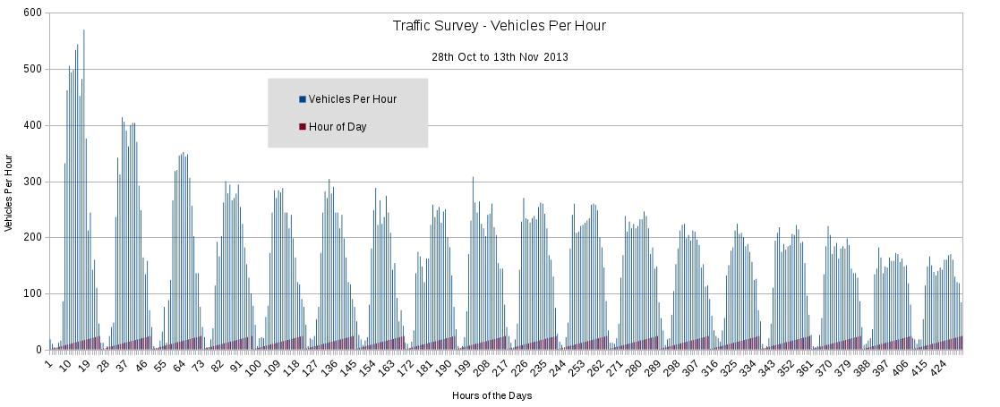

**Long term Traffic flows Per Day for "Holiday week" + "Normal week" October 2013 at sample site, Triggered Image system, 3x Calibration**

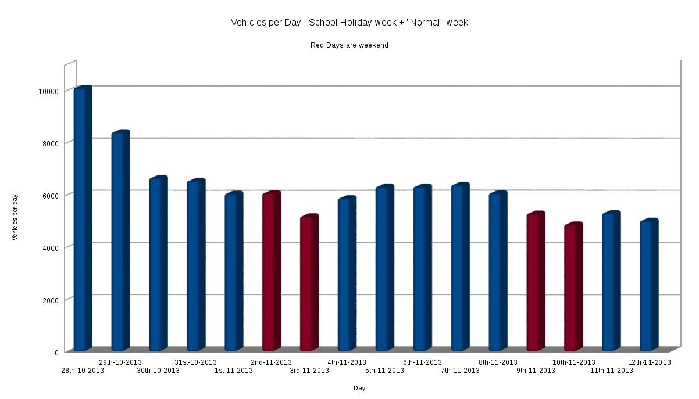

**Manual Calibration Data 2013 - shown as Vehicles Per Hour, for each 5 minute sample**

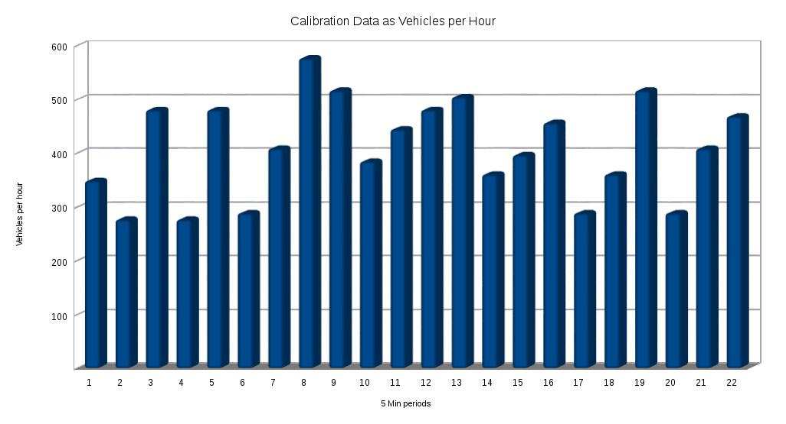  

**Where can I find further analysis from the test site?**

The data analysis document (TrafficDataAnalysisMethodology.md) shows some further details on additional charts and analysis of the Traffic data sampled at the test site. All the charts used are in the /charts directory. The template spreadsheet also contains data and charts from an actual survey at the test site.  

[Summery of Traffic Data at the test site from 2010 to 2016](TrafficDataAnalysisMethodology.md "Traffic Data analysis Methodology")

[Oldham Test Site : Traffic against Noise, conclusions and results 2016](CalibratingTrafficAgainstPollutionP1.Noise/README.md "Latest Survey results for Test Case")

**Possible future developments for Open Traffic survey**

https://github.com/delsmith/Traffic-Survey-Development

This Github contains a reversed engineered version of "Traffic Speed Survey" software used by standard equipment in countries. It would be possible to convert data from the counter to be input into the spreadsheet and vice versa.

The possibility of using information from other sensors such as Wi-Fi interference, noise monitoring, Kinect, motion detector for instance, and having a system to store / analyse that data.  

Developing and training an A.I. to automatically analyse incoming traffic data and simulate the various calculations in real time.
  
Add additional calculations, for instance the vehicle flows could be calibrated to show pollution levels.  The accuracy of data from a triggered system might be improved by having speed related calibration.

It is possible to test other systems and calibrate them for traffic flow. For instance, the level of mpeg processing on a video which is mainly the road and traffic will be proportional to the traffic levels and would automatically add some compensation that lorries and buses are louder and more polluting when each passes an effected person on the street or in adjacent properties.  

**Licensing**  
  
{**OpenTrafficSurvey**}
    Copyright (C) {2015 / 2016}  {Wrapperband}

    This program is free software; you can redistribute it and/or modify
    it under the terms of the GNU General Public License as published by
    the Free Software Foundation; either version 2 of the License, or
    (at your option) any later version.

    This program is distributed in the hope that it will be useful,
    but WITHOUT ANY WARRANTY; without even the implied warranty of
    MERCHANTABILITY or FITNESS FOR A PARTICULAR PURPOSE.  See the
    GNU General Public License for more details.

    You should have received a copy of the GNU General Public License along
    with this program; if not, write to the Free Software Foundation, Inc.,
    51 Franklin Street, Fifth Floor, Boston, MA 02110-1301 USA.

