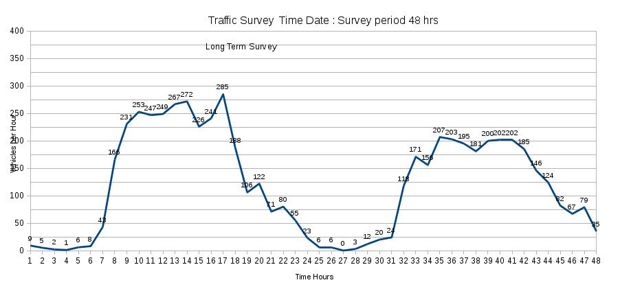
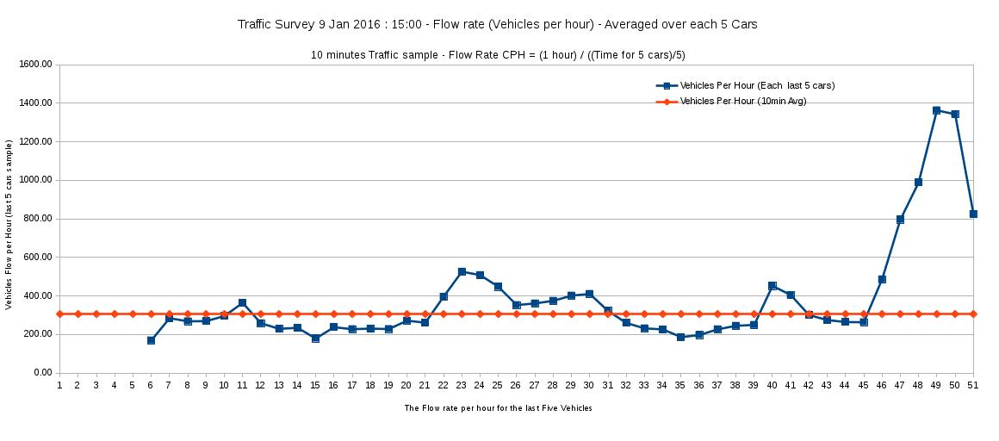
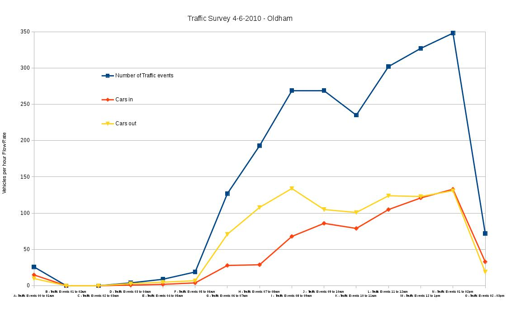
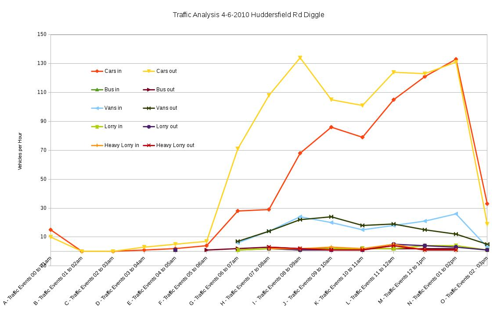
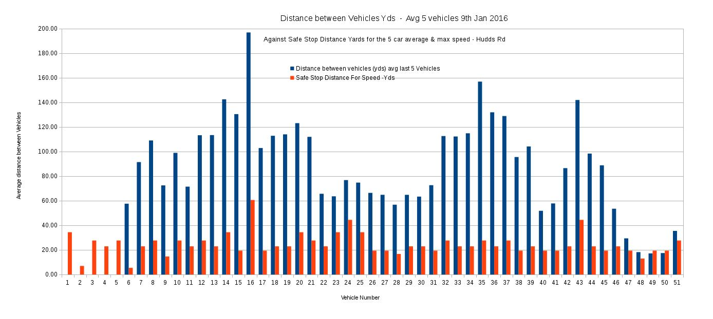
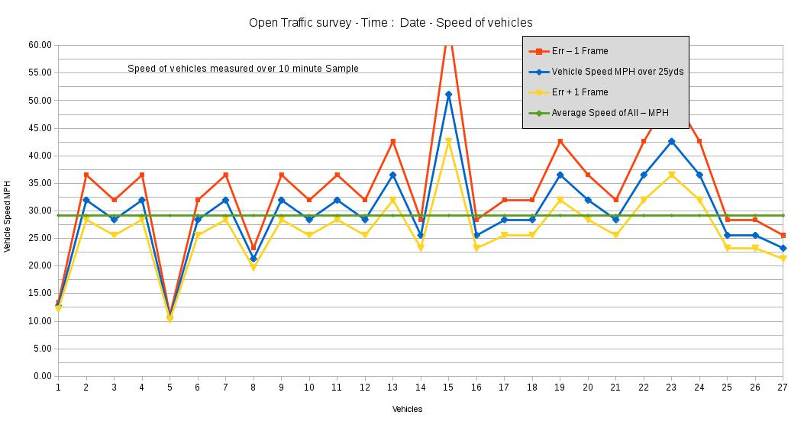

#Open Traffic Survey
**Introduction to a citizen Traffic Survey Methodology**

The aim of Open Traffic Survey is to outline a procedure which retains un-tamperable (video) evidence of Traffic characteristics and provide an open source spreadsheet into which data can be input and visualised with charts.  

**Open Traffic Survey : History of development**

The Open Traffic Survey is the result of "6 years work" (not contiguous) monitoring and analysing the traffic on a minor road in Oldham.  

The methodology arises from long term notes / study of how A.I. or Machine Learning techniques could assist in continuous environmental surveys such as traffic levels. i.e. it is an open source project to enable Environmental monitoring, contributions welcome.

The necessity to start manual analysis and record keeping arose out of the requirement of a local planning action group to have some source of "provable in court" information on the environment and how it was changing. That investigation resulted in various charts and calculations to show/ visualise the true effect of "average vehicle flows" being experienced by the community. 

It was also envisaged that the system could be used to confirm or refute the error levels of "official data" collected at the time. In the test case where Traffic readings were taken at a non standard road position which would emphasis the low speed under counting, a known source of inherent error when using the low cost "Traffic Speed Surveys" systems for calculating "Traffic Flow Rates".

This chart is from the first spreadsheet with data taken from Video evidence, then manually counting the number of vehicles into  each hour "pot". A time consuming, but satisfying task as it dispelled pre-conceived ideas of what the traffic flows were. Evidence of high traffic levels on weekends and holidays dispelled the myth that heavier traffic in the week could be allowed as there is respite at the weekend, for instance ..... 

**Traffic flow rates for 29th to 30th 10.2010**

  

**Open Traffic Survey : Observations and Results from Test Surveys**

Various techniques and common equipment were tested for potential use as sensors and analysis to speed up the time consuming parts of the process of auditing traffic levels. 

In the 2015 survey, a triggering mechanism was used to save a single or small number of stills as each vehicle passing, which could be simply counted as the number of files in a folder for that time period. 

This proved effective for long term monitoring, it was used to prove there was no early morning or  early evening peak in traffic in our case. The drawback with the video image triggering method it had to be subject a significant calibration. Although it was consistent it under estimated the traffic by 1/3. (With a traffic flow of one car every 12 seconds) The calibration may be lower for lower flows, but meant the values need to be multiplied by 3 to get the actual figure. 

However, the video trigger method was surprisingly accurate,  for a method which required such a large calibration factor, when sample tested with a manual count of traffic from a video ..

Examination of the video evidence, compared to the triggered photo method showed the reasons why it underestimates the flow ... 

1. At the traffic levels on the road, traffic was often bunched <  less than the re-trigger time for the system.
2. Vehicles often passed in opposite directions at that point in the road ( between parked cars) only triggering one event.

**Open Source Systems : Philosophy**

The "Open Traffic Survey" is conceived as part of Open Condition Monitoring Tools, which is also conceived as open source tools to enable to enable the public to run easily audit-able "Open Governance Systems" or "Government monitoring systems".

  Open Governance  
    https://github.com/MrChrisJ/World-Citizenship  
    https://github.com/wrapperband/Open-Condition-Monitoring  
        Traffic flow estimator   

**Example Traffic flow charts from the spreadsheet**

**Traffic Flow Rates 2016**  

  

**Traffic Survey of vehicles types 2010**

**Traffic Survey of vehicles types 2010**

**Distance Between Vehicles - 2016**

**Speed of Vehicles - 2016**

**Possible future development**

https://github.com/delsmith/Traffic-Survey-Development

This Github contains a reversed engineered version of "Traffic Speed Survey" equipment used many countries. It would be possible to convert data from the counter to be input into the spreadsheet and vice versa.

The possibility of using information from other sensors such as Wi-Fi interference, noise monitoring Kinect and having a system to store  and analyse that data.

{OpenTrafficSurvey}
    Copyright (C) {2015 / 2016}  {Wrapperband}

    This program is free software; you can redistribute it and/or modify
    it under the terms of the GNU General Public License as published by
    the Free Software Foundation; either version 2 of the License, or
    (at your option) any later version.

    This program is distributed in the hope that it will be useful,
    but WITHOUT ANY WARRANTY; without even the implied warranty of
    MERCHANTABILITY or FITNESS FOR A PARTICULAR PURPOSE.  See the
    GNU General Public License for more details.

    You should have received a copy of the GNU General Public License along
    with this program; if not, write to the Free Software Foundation, Inc.,
    51 Franklin Street, Fifth Floor, Boston, MA 02110-1301 USA.

