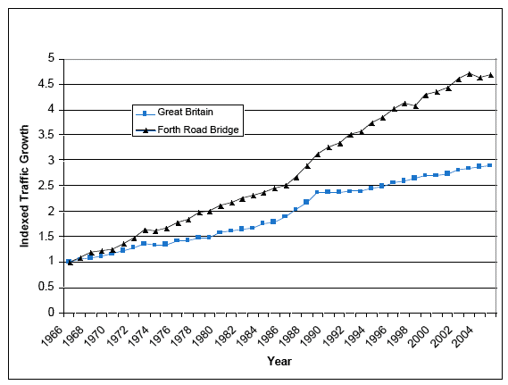

## Open Traffic Survey
**Methodology for analysing the Traffic data with the citizen traffic survey spreadsheet**

The data analysis methodology describes the fields in the template spreadsheet using real data from a number of Traffic audits to explain what they mean and how they are calculated.

The analysis and observations reported at the time have been included, along with some updates to the spreadsheet, to provide more documented charts and guides to show how it can be used and errors and limitations. 

The aim is to make a difficult task of analysing data easier for anyone to do, and provide more detail automatically, if possible. Where it is not there are tips and explanations of such as what problems occurred and how situations might differ and how that could be dealt with.

A number of other side studies are also noted, such as direction of vehicle or various methods of simulating the effect of proposed changes.

**Fields of the spreadsheet**

**Information fields for the Spreadsheet.**

Rows 4, 5 and 6 of the spreadsheet store the identification data for the survey and total and average information collated from the subsequent analysis columns.  

**Cells on the Template sheet**

Cell E4  - **Address of Traffic Survey location**  

Input the Address and postcode of the position the video of traffic was taken

Cell E5 & F5 - **Distance  25 Yards**

Measured distance travelled by the vehicles entering and leaving the analysis box.

The spreadsheet has been updated to be interactive, the Vehicle speed and error is calculated using the Distance in Yards in Cell $F$5, which has been marked sky blue in the template.

Cell 6E & 6F - **Video - 2016-01-09-1-15.00-1.avi**

Name of the Traffic Flow Evidence video that is being analysed

Cell E7 - **Time**

Time the analysis was initiated.

Cell F7 - **Date** 

Date the analysis was initiated.

**Example collated average and totals / information for the full period of the Traffic Analysis**

Description of Calculation | Example Value
-------------------------- | -------------
Vehicles Per Hour   |	306.00  
Average Speed MPH   |	29.17  
MaxSpeed MPH   |	51.14  
MinSpeed MPH   |	10.65  
Traffic Flow VPH Max   |	592.11  
Traffic Flow VPH Min   |	71.54  
MaxDistanceBetweenVehicles   |	196.88  
MinDistanceBetweenVehicles   |	17.19  
Traffic Flow VPH Avg   |	733.24  
AvgStoppingDistance   |	24.61  
MaxStoppingDistance   |	60.63  
MinStoppingDistance   |	5.44  
AvgDistanceBetweenVehicles Yds   |	88.83  

The Vehicles per hour is calculated from the sample length in minutes Cell F8   :  =(COUNT($I$10:$I$60)*(60/F8))  

It is important to check the calculation ranges and the ranges of the charts after imputing new data. In particular the Vehicles per hour which relies on knowing the sample length as well as which columns the data is in.  

**Columns of the spreadsheet**  

**Input the video frame number for each vehicle entering and leaving the measurement "box"**  

Start Frame |   End frame
----------- |   ---------
0          |      
14         |    21  
239	   |    259  

At Cell C8 is where you input data into the spreadsheet. The template is set up to input data for 25yards survey at 5 frames per minute. Even so the figures rapidly increase in value, so cutting the frame number (Cntr-C) from the frame number box in Avidemux and pasting it into the spreadsheet, saves time and prevents errors.

*Note : It important to mark each vehicle "as it enters the Box".*   

*Note : Avidemux no linger shows frames for compressed video files. The test cases shows a simplified spreadsheet based on time vehicles pass. The old spreadsheet has been modified to work with frame time for a full analysis. Because there are now various formats depending on the type of survey, and appropriate spreadsheet should be used as the template for a new survey.*  

Care needs to be taken when vehicles are arriving in the box, to input them in order into the spreadsheet. On the video, one vehicle arrives from left, you must input the arrival frame and exit frame of that vehicle, whilst noting to go back, because another vehicle was behind it or arriving from the other direction....

**Calculating the time to Traverse the measurement "Box"**  

Frames	|    Accurate Time (secs)
------  |   ---------------------
7	| 1.40  
20	| 4.00  
8	| 1.60  
9	| 1.80  
  
The next two columns, frames and Time, are calculated from the input data, the number of frames it took the vehicle's bonnet to enter the 25 yards, to when it's bonnet exits the 25 yards measurement box. Care must be taken, however it can soon be seen that an error of 1 frame at 5 frames per second, does not actually effect the required accuracy of results.  

**Vehicle direction**  

0 = Left to Right   |  
-----------------  |  
0   | 
1   |  
0   |  
0   |  
0   |  
  

The "left right" column holds the information on which direction the traffic is travelling.   

The spreadsheet currently averages data from left and right for some "insight" into instantaneous.   

0 = Entered from Left  
1 = Entered from Right  

In order to do that each event is also noted a 0 left to right and 1 right to left. This leaves the possibility that the data can be split and analysed in one direction later, but doesn't add the confusion of using separate sheets, for left and right traffic.  

**Method for dividing the traffic into left and right**

In the test case the traffic was  evenly divided in each direction. It was possible to total the in each direction, for each data set. The method is show in cell G62, was to sum the 1s in the left / right direction column G, then take this value from the total number of vehicles to obtain the number travelling from left to right, and marked with "0". 

 **Into Town R to L** =SUM(G10:G60)
 **Out of Town L to R** ==((COUNT(G10:G60)-G62))

In order to produce separate charts for each direction, 

First make a copy of the data sheet.

Use the sort facility (menu / data sort), to sort all the columns in order of column G primary and  with column C as secondary sort. 

The charts can be copied and the new ranges set for each direction. It will be necessary to delete a couple of the last 5 vehicles calculations, to compensate for less vehicles in each side, after the split.  

*Note : Using the Template sheet, setting the ranges of your data.*

Some of the calculations require the setting of ranges, or start and end of cell positions, to count the vehicles, or find the maximum. It is usual to check each calculated column, updating the start and end position accordingly. Then copy the corrected cell down all the cells of the column.  

You can use the shift key highlight a block of cells then past the new equation into the whole column.  

*Note : Using the template sheet for your case*

The current sheet is an example sheet set up for 25yards and 5 frames per second video. However, as the sheet is being generalised from a real sheet it is recommended you study how the calculations were done and wither they fit your case. An alternative sheet  to reduce the work, but quickly show flow levels is "in development" i.e it is just a cut down version of the current spreadsheet.  

**Vehicle speed and error calculations**  
  
Err – 1 Frame	| Vehicle Speed MPH over 25yds	|  Err + 1 Frame  
-------------   | ----------------------------  |  -------------
42.61   |   36.53   |   31.96  
13.46   |   12.78   |   12.18  

The vehicle speed is calculated from the exact time, calculated from the number of frames the vehicle took to traverse the 25 yards of the measurement distance. The error is calculated for 1 frame when a video frame rate of 5 frames per second is used. The system was tested and has to be converted from 24 frames per second, where even using a 5 frame error the video method was accurate.  

**Calculating the percentage errors the sample survey case above :**  

*The error at normal vehicle speeds*  

36.53 - 31.96 = 4.57   gives an error of (4.57 / 36.53) * 100 = 12 %  maximum error in speed  
42.6 - 36.53 = 6.07    gives an error of (6.07 / 36.53) * 100 = 17 %  maximum error  

*The error for slow speed vehicles*  

12.78 - 12.18 = 0.6  which gives a lower maximum error of  (0.6 / 12.78) * 100 = 4.7 %  maximum error  
13.46 - 12.78 = 0.68 which gives a  maximum error of       (0.68 / 12.78) * 100 = 5.32%  maximum error  

In which case the error was calculated for 5 frames was in fact the same as one frame at 5 frames/sec. if the additional accuracy and storage space no object the error can by reduced by a fifth by using 25 frames a second or greater video frame rates.  
  

**Vehicles flow rate per hour and per last 5 vehicles**  

Vehicles Per Hour (Each  last 5 cars)   |   Vehicles Per Hour (10 minutes Sample)
-------------------------------------   |   -------------------------------------
        |                                306.00   
        |                                306.00   
        |                                306.00   
        |                                306.00   
        |                                306.00   
165.14	|                                306.00
166.36	|                                306.00
260.12	|                                306.00

Vehicles per hour is calculated by totalling the vehicles for the sample period in this case 10 mins. This is then multiplied by how many times the sampling period fits into one hour. In the example case there are 6 10minutes in One Hour.  

Vehicles per hour last 5 cars, calculates the time for 5 cars to pass, then the time for one car to pass is 1/5th of that. Dividing the time for one car into one hour gives the number of cars per hour, for the last 5 cars.  

The vehicles per hour calculation could be extended to 10 vehicles, that would damp further the indication of peak traffic levels as traffic bunches which the smaller sample gives. Ideally it should be for each 2 vehicles, to measure absolute "bunching" factor.  

Note : the calculation cannot start till five vehicles have passed, which is why the first 5 fields of Vehicles per hour (last 5 vehicles) are empty.  

It is noted that it would be possible to calibrate pollution levels to the instantaneous or "5 car average" flow rates, these being much higher when vehicles are "bunched".  

**Calculating the distance between vehicles**  

Distance between Vehicles Error – 1 frames  |   Distance between vehicles (yds) avg last 5 Vehicles |   Distance between Vehicles Error + 1 frames  
------------------------------------------  |   --------------------------------------------------- |   ------------------------------------------  
  |  |  
60.12   |   57.62   |   55.31  

Distance between the vehicles is estimated from speed of the vehicles, and how far that would have travelled in the time for the 5 vehicles to pass. There is an add complication of averaging left and right hand traffic in the example sheet. However, the average is re-calculated for every vehicle which shows the assumptions are reasonable in the test case where traffic was evenly balanced left to right.  

It is noted that a method of splitting the left and right sheets for some results would be advantageous, or a more advanced sheet to get over that problem / extra work, some other way.  

**Safe stopping distance calculations**

Safe Stop Distance For Speed -Yds   |   Safe Stop Distance For Speed – F    |   Distance between vehicles (yds) min last 5 Vehicles  
---------------------------------   |   --------------------------------    |   ---------------------------------------------------  
34.41   |   103.23  |   
6.99    |   20.96   |   
27.68   |  83.03   |  
22.92   |  68.76   |  
27.68   |  83.03   |  
5.44   |  16.33   |  11.52  

Safe stop distance uses the speed reading and the standard speed v. stopping distance equation to generate the safe stop distance for that vehicle (dry conditions).   

After 5 vehicles pass it is then possible calculate or extract the min, max or average distance between cars. As there are various causes of bunching and sometimes vehicles stop to allow passing the spreadsheet includes the Average distance.  

**Example of a simple simulation 2 x traffic level**

Vehicles per Hour – with Twice / X times  the Traffic   |   Vehicles Per Hour (Each last 5 cars) – With Simulated Traffic  
-----------------------------------------------------   |   -------------------------------------------------------------
612.00  |	 
612.00  |	 
612.00  |	

**Example of more complex Traffic Simulations methods**

For the test case it was calculated that extra traffic between 8:15 and 9:00 would more than triple the level of traffic at that time. In this case a copy of the data sheet was made and 2 extra vehicles were added "automatically" using a simulation equations in Columns A and B to find the time of the two vehicles between each set of vehicles.
The simulation isn't included as it will be site specific.

Time between Simulated Vehicles – Minutes   |   Calculated Frames  Between Vehicles	|    Start Frame |   End frame  
-----------------------------------------   |   -----------------------------------  |  -----------    |   ---------  
	|  |	| 0.00	 
0.0467	|    |   14.00	|    21.00  
0.2967	|    75.00	| 89.00   |   96.00  
0.5467	|    75.00	| 164.00	|    171.00  
0.7967	|    |	239.00    |	259.00  
0.8089	|    3.67    |	242.67    |	262.67  
0.8211	|    3.67    |	246.33    |	266.33  

The new arrival times are calculated with =(C13-C10)/3 in Cell B11  and =(C13-C10)/3 in B12.  

The new start frame and end frame is the previous vehicle + the new time between vehicles, = C10+B11, the end frame =D10+B11.   

Cell A shows the time in minutes between vehicles =C10/(60*5) , shows the time each vehicle arrives and confirms the length of the simulation.  

**Charts from the input and calculated traffic Data available in the template spreadsheet**

The  charts are separated as Tabs.  

Sheet 1 is called Data input and Calculations.  
Sheet 2 contains the speed charts with errors.  
Sheet 3 covers vehicle overall and short term flow rates.  
Sheet 4 shows separation of vehicles compared to safe stopping distance for the vehicle speeds.  

**Spreadsheet Manual Count & Calibration Tab**

In order to fully calibrate the trigger method of estimating traffic levels and have an extended set of accurate manual readings  2 hours traffic in November 2013. Each 5 minute section of traffic was manually counted from a video against triggering an Image by movement.  

The results were input into Spreadsheet Manual Count & Calibration Tab. The resulting charts are available, ReadMe.md  shows for the 5 minute sample chart and the 10 min sample chart is shown below. Manual Calibration.v.Triggered-10minSample.  

The calibration data also contains information about the variability of samples lengths. For a 5 minute sample a variability for Manual reading, gives the actual variability of the traffic at 23%. The variability increases to 28% for the trigger method, 5% additional variability.

This information can then be used to assess the accuracy of other samples. The test sample was 10 minutes long, by adding each of the 5 minute samples together, it was then possible to estimate the variability of the 10 Minute sample.  

**Manual traffic count against triggered count - for 10 minute samples of Calibration data**

  

The following chart shows just how conservative the 2 times Multiplier used when presenting the 2013 test results initially probably was. It shows the multiplying factor each trigger sample would need to used to get the correct reading of traffic.... :

  

**Spreadsheet calibration results for 5 minute samples**  
  
    |   | Sample Variation %   
--------------------------------------  |   ------ |    ------    
    |    	  
Average Calibration	|   4.31	|  29.06 |  
Maximum Calibration	|   6.67	|  |  
Minimum Calibration	|   1.92	|  |  
Average Vehicles Per Hour (Manual)	|    403.83	|    22.68  
Average Vehicles Per Hour (Triggered)	| 99.13	| 27.85  

Manual Count 5mins	|    Measured with Trigger	| Manually Counted Per Hour	| Measured with automatic count Per Hour	|    Calibration Multiplier
------------------  |   ---------------------   |   -------------------------   |   --------------------------------------   |    ----------------------
29	|    13  |	348.0 |	156.0	|   2.23
23	|    8   |	276.0 |	96.0	|    2.88
40	|    10  |	480.0	|   120.0	| 4.00
23	|    12	| 276.0	|   144.0	| 1.92

By using a 10 minute sample the variability / Standard deviation was reduced from 23% to 15%.  

This shows that the sample readings taken over 10 minutes is a 1/3 more accurate at predicting the "actual" traffic levels over the day.  

Also, it shows that a reading of 310 vehicles per hour in one 10 minute period is within the standard deviation of  310 + (15 * 310)/ 100 = 357.  
 
This means the actual reading is likely to be in the range  310 +/- 45  for the test case.

*How much does reducing the sample length decrease accuracy?*
 
For a 5 Minute sample  310 + (23 * 310) / 100 = 381  

This means the hourly estimate from the 5 minute sample  is likely to be within  310 +/- 71

This shows that a 5 minute traffic flow sample gives reasonable indications of traffic per hour, for the flow experienced at the test site. Thus a very accurate measure of the traffic could be made by taking a 5 minute sample every hour to obtain long term levels. However, it was noted that even 5 minutes of data contained a significant amount of traffic and therefore work to analyse.  

**Spreadsheet calibration results for 5 minute samples**

	|	| Sample Variation %
--------------------------------------  |   ------ |    ------    
	|	|    	
Average Calibration	|   4.21	|  27.37 |
Maximum Calibration	|   6.00	|  |
Minimum Calibration	|   2.482	|  |
Average Vehicles Per Hour (Manual)	|    399.00	|    15.99
Average Vehicles Per Hour (Triggered)	| 99.50	| 22.19

*Note that the last cell had to be doubled because there was an odd number of 5 minute sample. The doubled sample which was a less than average value.*

**What is the effect of Holidays?**

The 2013 survey at the test site contained two main parts, manual data collection. Testing a video trigger system, and recording long term traffic. 

By setting the trigger to record 1 or more images for each trigger it is then much easier to count the number of events. It was also possible to record direction or other details with more work.

During the test period collected by trigger method it was possible to look into more detail what constituted holiday traffic by showing the difference between the same days. 

**Chart for Bank Holiday 28-10-2013 at the test site at low end calculated calibration  3x .**  

  

Here is the chart showing the following Monday's flow minus the bank holiday flow.  The difference chart is entirely consistent with what would be expected. The next week the morning and evening traffic is increased and the traffic during the day is vastly reduced.  

**Chart for "Monday Data" Minus "Bank Holiday Data" 10-2013 at the test site**

  

This chart shows the "normal" daily traffic and the difference / increase there is on the bank holiday Monday.  

**Chart of Daily Rate over 2 weeks Triggered Data collection at 3x Calibration level**

  

**What is the difference between Morning and Evening Traffic?**

Using Data from the 2013 survey, it was possible to add the hourly traffic together to get a picture of the Traffic over the long term survey. It was obvious that factors such as holidays were effecting the results, so it would be expected to be slightly different for non bank holiday times or other "events".

Here is the "Long Term survey" 10.2013 - Morning Traffic  

**Chart of Traffic in Mornings over 2 weeks : Triggered Data collection at 3x Calibration level**

  

Here is the "Long Term survey" 10.2913 - Afternoon / Evening Traffic.  

**Chart of Traffic in Afternoon over 2 weeks : Triggered Data collection at 3x Calibration level**

  

**How to estimate the Yearly increase in Traffic**

In any development there needs to be more information of predicted future development and the effect of using old data to create and audit plans. In particular it is well known that traffic increases on a year by year basis.

From data produced by http://www.transport.gov.scot/report/j8512a-07.htm where figures have been recorded long term for traffic over the Forth Bridge :

**Forth Road Bridge – Indexed Northbound Traffic Flow 1966 – 2005 (1966 = 1.0)**

  

The road Bridge, being such an out of the way site and not subject to inordinate local development, traffic figures for the Bridge should give a good indication of the overall increase in traffic levels in the UK.  As can be seen in the traffic chart for the bridge, the annual rate of traffic growth on the Forth Road Bridge has in general exceeded the annual national rate of traffic growth.  

The annual average growth rate for Great Britain is 2.8% while the average annual growth rate on the Forth Road Bridge is 4.2% from 1966, while. It is noted that the North bound traffic more closely represents the UK average at 2.2%.

**On average Traffic is increasing by "2.8 Percent Per Annum" in the UK.**  

It would be relatively simple to add extra columns to the template spreadsheet to simulate how the yearly 2.8% increase in flow would effect traffic over the next 5 years at any site.  In some cases that information could tip the balance and prove traffic levels would then be at unacceptable levels for the infrastructure. 

Simulating future effects also shows that the parties were made aware of the extra pollution, noise and strain on infrastructure that "developments" will cause and the level of the harm full effect that is being sanctioned.  

**Indexed Traffic Growth 1966 to 2005 – Forth Road Bridge and GB (1966 =1.00)**

  

**Predicting addition normal traffic at the test site**

The following charts show the predicted hourly and daily traffic levels as they increase over the next years with no developments, just the increase in national average vehicle use...

Over 10 years the traffic would increase from 444 to 585 vehicles per hour, an cumulative increase of 132%.

**Chart of predicted increase in Normal test site Traffic per Hour over next 13 years**

  

**Chart of predicted increase in Normal test site Traffic per Day for the next 13 years**

  

**How does UK planning calculate Traffic Flow increases?**

In the case of the test site the prediction figures were calculated with TEMPRO. 

http://laqm.defra.gov.uk/documents/TEMPRO_guidance.pdf

Using the worked example, the test site is close to main Urbanisation and subject to excessive development for the space in restricted valleys. The traffic increase Nationally is 1.0577 or 5.57% per year.

In another example or a rural road with development in Somerset, the adjusted local increase was 1.225 using TEMPRO. That seems impossibly large, and they may have meant 1.025.

http://www.leics.gov.uk/lt09.pdf

In another similar example of high income area commuting similar to the test site the TEMPRO factor was set as 1.072 reflecting fuel cost to reduce the (probable) figure. 

The chart shows the Growth in Traffic at the test site using TEMPRO "calibration" figures.

**How to confirm or find traffic trends in your area?**

One way to get more figures for your are (if avaialable) is "Roadside survey of vehicle observations" released under OpenGovernmentLicence.

The roadside survey is a survey of vehicles passing observation points on the UK road network. It uses automatic numberplate recognition (ANPR) cameras to capture registration marks at 256 sites during June each year (or every other from 2011 onwards). 

https://data.gov.uk/dataset/roadside-survey-of-vehicles

**Traffic Flow Rates - Predicted increase from 2016 - Flow per Hour**  

  

**Traffic Flow Rates - Predicted increase from 2016 - Flow per Day**  

  

**How accurate are the Traffic figures being presented to Planning?**

In 2011 a report on how Transport for London manipulated the figures they used, with no come back : From : https://cycleoffutility.wordpress.com/category/blackfriars-bridge   

It is clear that most modern plans are developed by specialist in hiding any inconvenient information, *that is their Job.*

    In September, Transport for London released a copy of a presentation they had submitted to the 
    London Assembly about Blackfriars Bridge.

    This contained some rather extraordinary claims, for example this projection (p3):

    AM peak 2012 – pedestrians 58%, cyclists 6%, car occupants 14%

    Given that there are currently more cyclists than car occupants, and cycling is increasing 
    while driving is decreasing, the above is quite clearly wrong.

    Thanks to the tenacity of London Assembly Member John Biggs (and his researchers), TfL has 
    been forced to release an explanatory note, which shows the dubious assumptions that 
    they have made in order to arrive at these figures.

**Transport For London :**  

    *  Citing a figure from the Department for Transport’s guidelines, but actually using 
       a different figure.
    *  Extrapolating about what will happen at Blackfriars based on a survey about travel 
       in the whole of London – when we have exact figures at Blackfriars going back to 1986.
    *  Using a dataset from JMP consultancy, rather than TfL’s own screenline counts, where 
       the consultancy’s figures lend more support to TfL’s argument.
    *  Despite cycling increasing every year at Blackfriars since 1994, assuming that there 
       will be no increase between 2010 and 2012.
    *  Similarly, despite people driving cars decreasing every year since 1996, assuming 
       that this will not change between 2010 and 2012.

  
    

